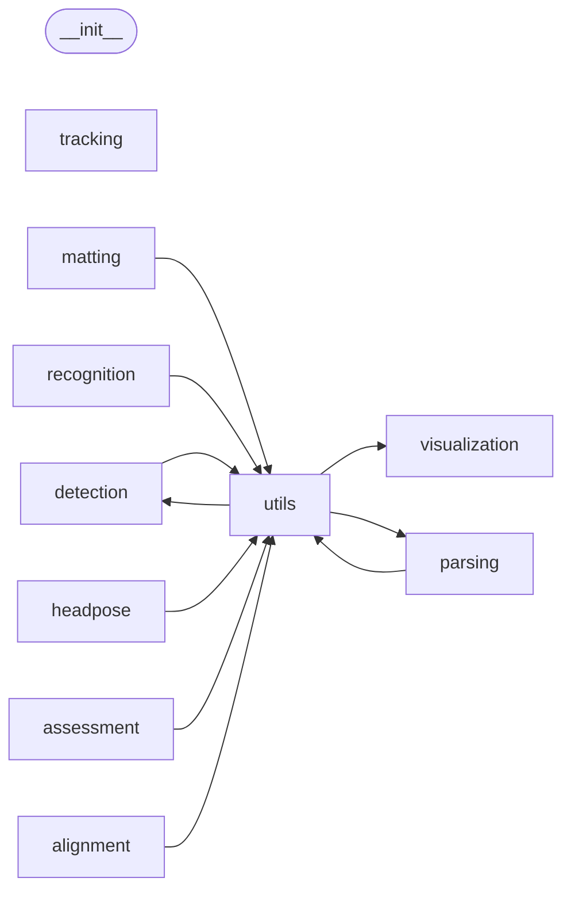

# Code Overview

[_Documentation generated by Documatic_](https://www.documatic.com)

<!---Documatic-section-Codebase Structure Python-start--->
## Codebase Structure Python

The codebase has a single-depth folder structure,
                with 36 code files in total.

<!---Documatic-block-system_architecture-start--->

<!---Documatic-block-system_architecture-end--->

# #
<!---Documatic-section-Codebase Structure Python-end--->

<!---Documatic-section-Important Functions-start--->
## Important Functions

<!---Documatic-block-important_funcs-start--->
<!---Documatic-block-most_used_funcs-start--->
### Most Utilised Functions

* [facexlib.utils.misc.load_file_from_url](6-facexlib_utils.md#facexlib.utils.misc.load_file_from_url) (8 times)
* [facexlib.visualization.vis_detection.visualize_detection](4-facexlib_visualization.md#facexlib.visualization.vis_detection.visualize_detection) (2 times)
* [facexlib.detection.__init__.init_detection_model](3-facexlib_detection.md#facexlib.detection.__init__.init_detection_model) (2 times)
* [facexlib.utils.misc.img2tensor](6-facexlib_utils.md#facexlib.utils.misc.img2tensor) (2 times)
* [facexlib.detection.align_trans.get_reference_facial_points](3-facexlib_detection.md#facexlib.detection.align_trans.get_reference_facial_points) (1 times)
* [facexlib.detection.align_trans.warp_and_crop_face](3-facexlib_detection.md#facexlib.detection.align_trans.warp_and_crop_face) (1 times)
* [facexlib.detection.retinaface_net.make_bbox_head](3-facexlib_detection.md#facexlib.detection.retinaface_net.make_bbox_head) (1 times)
* [facexlib.detection.retinaface_net.make_class_head](3-facexlib_detection.md#facexlib.detection.retinaface_net.make_class_head) (1 times)
* [facexlib.detection.retinaface_net.make_landmark_head](3-facexlib_detection.md#facexlib.detection.retinaface_net.make_landmark_head) (1 times)
* [facexlib.detection.retinaface_utils.batched_decode](3-facexlib_detection.md#facexlib.detection.retinaface_utils.batched_decode) (1 times)
* [facexlib.detection.retinaface_utils.batched_decode_landm](3-facexlib_detection.md#facexlib.detection.retinaface_utils.batched_decode_landm) (1 times)
* [facexlib.detection.retinaface_utils.decode](3-facexlib_detection.md#facexlib.detection.retinaface_utils.decode) (1 times)
* [facexlib.detection.retinaface_utils.decode_landm](3-facexlib_detection.md#facexlib.detection.retinaface_utils.decode_landm) (1 times)
* [facexlib.detection.retinaface_utils.py_cpu_nms](3-facexlib_detection.md#facexlib.detection.retinaface_utils.py_cpu_nms) (1 times)
* [facexlib.detection.matlab_cp2tform.get_similarity_transform_for_cv2](3-facexlib_detection.md#facexlib.detection.matlab_cp2tform.get_similarity_transform_for_cv2) (1 times)
* [facexlib.visualization.vis_alignment.visualize_alignment](4-facexlib_visualization.md#facexlib.visualization.vis_alignment.visualize_alignment) (1 times)
* [facexlib.visualization.vis_headpose.visualize_headpose](4-facexlib_visualization.md#facexlib.visualization.vis_headpose.visualize_headpose) (1 times)
* [facexlib.utils.face_restoration_helper.get_largest_face](6-facexlib_utils.md#facexlib.utils.face_restoration_helper.get_largest_face) (1 times)
* [facexlib.parsing.__init__.init_parsing_model](5-facexlib_parsing.md#facexlib.parsing.__init__.init_parsing_model) (1 times)
* [facexlib.utils.misc.imwrite](6-facexlib_utils.md#facexlib.utils.misc.imwrite) (1 times)
* [facexlib.utils.face_utils.align_crop_face_landmarks](6-facexlib_utils.md#facexlib.utils.face_utils.align_crop_face_landmarks) (1 times)
* [facexlib.utils.face_utils.compute_increased_bbox](6-facexlib_utils.md#facexlib.utils.face_utils.compute_increased_bbox) (1 times)
* [facexlib.utils.face_utils.get_valid_bboxes](6-facexlib_utils.md#facexlib.utils.face_utils.get_valid_bboxes) (1 times)
* [facexlib.utils.face_utils.paste_face_back](6-facexlib_utils.md#facexlib.utils.face_utils.paste_face_back) (1 times)
* [facexlib.utils.misc.scandir](6-facexlib_utils.md#facexlib.utils.misc.scandir) (1 times)
<!---Documatic-block-most_used_funcs-end--->
<!---Documatic-block-important_funcs-end--->

# #
<!---Documatic-section-Important Functions-end--->

<!---Documatic-section-File IO-start--->
## File IO

<!---Documatic-block-file_io-start--->
The following files have file read operations

<!---Documatic-block-facexlib.alignment-start--->

	
<code>facexlib.alignment</code> (Click to Expand!)

* facexlib.alignment.convert_98_to_68_landmarks

<!---Documatic-block-facexlib.alignment-end--->
<!---Documatic-block-file_io-end--->

# #
<!---Documatic-section-File IO-end--->

<!---Documatic-section-Class Hierarchy-start--->
## Class Hierarchy

<!---Documatic-block-facexlib.detection.matlab_cp2tform.MatlabCp2tormException-start--->

	
<code>facexlib.detection.matlab_cp2tform.MatlabCp2tormException</code> (Click to Expand!)

* [facexlib.detection.align_trans.FaceWarpException](3-facexlib_detection.md#facexlib.detection.align_trans.FaceWarpException)
* facexlib.detection.matlab_cp2tform.MatlabCp2tormException

<!---Documatic-block-facexlib.detection.matlab_cp2tform.MatlabCp2tormException-end--->

<!---Documatic-block-facexlib.matting.backbone.BaseBackbone-start--->

	
<code>facexlib.matting.backbone.BaseBackbone</code> (Click to Expand!)

* facexlib.matting.backbone.MobileNetV2Backbone

<!---Documatic-block-facexlib.matting.backbone.BaseBackbone-end--->

<!---Documatic-block-facexlib.parsing.bisenet.AttentionRefinementModule-start--->

	
<code>facexlib.parsing.bisenet.AttentionRefinementModule</code> (Click to Expand!)

* facexlib.recognition.arcface_arch.Backbone
* facexlib.recognition.arcface_arch.Conv_block
* facexlib.recognition.arcface_arch.Depth_Wise
* facexlib.recognition.arcface_arch.Flatten
* facexlib.recognition.arcface_arch.Linear_block
* facexlib.recognition.arcface_arch.MobileFaceNet
* facexlib.recognition.arcface_arch.Residual
* facexlib.recognition.arcface_arch.SEModule
* facexlib.recognition.arcface_arch.bottleneck_IR
* facexlib.recognition.arcface_arch.bottleneck_IR_SE

<!---Documatic-block-facexlib.parsing.bisenet.AttentionRefinementModule-end--->

<!---Documatic-block-nn.Module-start--->

	
<code>nn.Module</code> (Click to Expand!)

* facexlib.matting.backbone.BaseBackbone
* facexlib.parsing.bisenet.AttentionRefinementModule

<!---Documatic-block-nn.Module-end--->

# #
<!---Documatic-section-Class Hierarchy-end--->

[_Documentation generated by Documatic_](https://www.documatic.com)