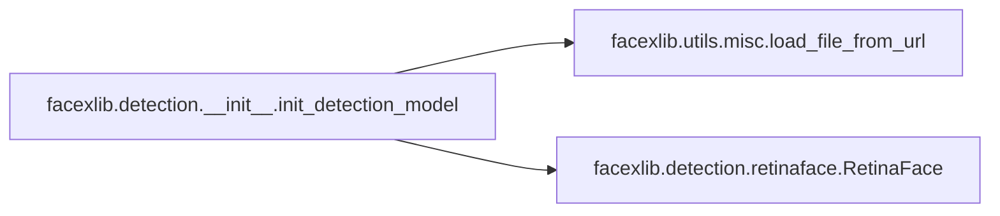
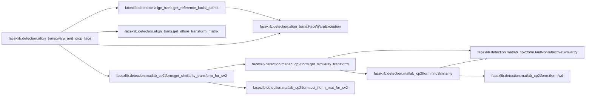
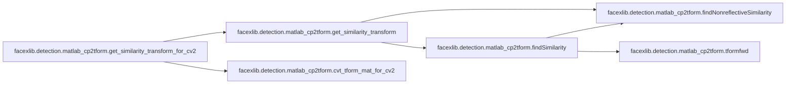
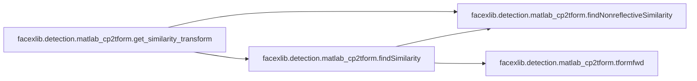

# Facexlib Detection

[_Documentation generated by Documatic_](https://www.documatic.com)

<!---Documatic-section-Codebase Structure-start--->
## Codebase Structure

<!---Documatic-block-system_architecture-start--->

<!---Documatic-block-system_architecture-end--->

# #
<!---Documatic-section-Codebase Structure-end--->

<!---Documatic-section-facexlib.detection.__init__.init_detection_model-start--->
## [facexlib.detection.__init__.init_detection_model](3-facexlib_detection.md#facexlib.detection.__init__.init_detection_model)

<!---Documatic-section-init_detection_model-start--->


### Object Calls

* [facexlib.utils.misc.load_file_from_url](6-facexlib_utils.md#facexlib.utils.misc.load_file_from_url)
* [facexlib.detection.retinaface.RetinaFace](3-facexlib_detection.md#facexlib.detection.retinaface.RetinaFace)

<!---Documatic-block-facexlib.detection.__init__.init_detection_model-start--->
<details>
	<summary><code>facexlib.detection.__init__.init_detection_model</code> code snippet</summary>

```python
def init_detection_model(model_name, half=False, device='cuda', model_rootpath=None):
    if model_name == 'retinaface_resnet50':
        model = RetinaFace(network_name='resnet50', half=half)
        model_url = 'https://github.com/xinntao/facexlib/releases/download/v0.1.0/detection_Resnet50_Final.pth'
    elif model_name == 'retinaface_mobile0.25':
        model = RetinaFace(network_name='mobile0.25', half=half)
        model_url = 'https://github.com/xinntao/facexlib/releases/download/v0.1.0/detection_mobilenet0.25_Final.pth'
    else:
        raise NotImplementedError(f'{model_name} is not implemented.')
    model_path = load_file_from_url(url=model_url, model_dir='facexlib/weights', progress=True, file_name=None, save_dir=model_rootpath)
    load_net = torch.load(model_path, map_location=lambda storage, loc: storage)
    for (k, v) in deepcopy(load_net).items():
        if k.startswith('module.'):
            load_net[k[7:]] = v
            load_net.pop(k)
    model.load_state_dict(load_net, strict=True)
    model.eval()
    model = model.to(device)
    return model
```
</details>
<!---Documatic-block-facexlib.detection.__init__.init_detection_model-end--->
<!---Documatic-section-init_detection_model-end--->

# #
<!---Documatic-section-facexlib.detection.__init__.init_detection_model-end--->

<!---Documatic-section-facexlib.detection.align_trans.get_reference_facial_points-start--->
## [facexlib.detection.align_trans.get_reference_facial_points](3-facexlib_detection.md#facexlib.detection.align_trans.get_reference_facial_points)

<!---Documatic-section-get_reference_facial_points-start--->


### Object Calls

* [facexlib.detection.align_trans.FaceWarpException](3-facexlib_detection.md#facexlib.detection.align_trans.FaceWarpException)

<!---Documatic-block-facexlib.detection.align_trans.get_reference_facial_points-start--->
<details>
	<summary><code>facexlib.detection.align_trans.get_reference_facial_points</code> code snippet</summary>

```python
def get_reference_facial_points(output_size=None, inner_padding_factor=0.0, outer_padding=(0, 0), default_square=False):
    tmp_5pts = np.array(REFERENCE_FACIAL_POINTS)
    tmp_crop_size = np.array(DEFAULT_CROP_SIZE)
    if default_square:
        size_diff = max(tmp_crop_size) - tmp_crop_size
        tmp_5pts += size_diff / 2
        tmp_crop_size += size_diff
    if output_size and output_size[0] == tmp_crop_size[0] and (output_size[1] == tmp_crop_size[1]):
        return tmp_5pts
    if inner_padding_factor == 0 and outer_padding == (0, 0):
        if output_size is None:
            return tmp_5pts
        else:
            raise FaceWarpException('No paddings to do, output_size must be None or {}'.format(tmp_crop_size))
    if not 0 <= inner_padding_factor <= 1.0:
        raise FaceWarpException('Not (0 <= inner_padding_factor <= 1.0)')
    if (inner_padding_factor > 0 or outer_padding[0] > 0 or outer_padding[1] > 0) and output_size is None:
        output_size = tmp_crop_size * (1 + inner_padding_factor * 2).astype(np.int32)
        output_size += np.array(outer_padding)
    if not (outer_padding[0] < output_size[0] and outer_padding[1] < output_size[1]):
        raise FaceWarpException('Not (outer_padding[0] < output_size[0] and outer_padding[1] < output_size[1])')
    if inner_padding_factor > 0:
        size_diff = tmp_crop_size * inner_padding_factor * 2
        tmp_5pts += size_diff / 2
        tmp_crop_size += np.round(size_diff).astype(np.int32)
    size_bf_outer_pad = np.array(output_size) - np.array(outer_padding) * 2
    if size_bf_outer_pad[0] * tmp_crop_size[1] != size_bf_outer_pad[1] * tmp_crop_size[0]:
        raise FaceWarpException('Must have (output_size - outer_padding)= some_scale * (crop_size * (1.0 + inner_padding_factor)')
    scale_factor = size_bf_outer_pad[0].astype(np.float32) / tmp_crop_size[0]
    tmp_5pts = tmp_5pts * scale_factor
    tmp_crop_size = size_bf_outer_pad
    reference_5point = tmp_5pts + np.array(outer_padding)
    tmp_crop_size = output_size
    return reference_5point
```
</details>
<!---Documatic-block-facexlib.detection.align_trans.get_reference_facial_points-end--->
<!---Documatic-section-get_reference_facial_points-end--->

# #
<!---Documatic-section-facexlib.detection.align_trans.get_reference_facial_points-end--->

<!---Documatic-section-facexlib.detection.align_trans.warp_and_crop_face-start--->
## [facexlib.detection.align_trans.warp_and_crop_face](3-facexlib_detection.md#facexlib.detection.align_trans.warp_and_crop_face)

<!---Documatic-section-warp_and_crop_face-start--->


### Object Calls

* [facexlib.detection.align_trans.FaceWarpException](3-facexlib_detection.md#facexlib.detection.align_trans.FaceWarpException)
* [facexlib.detection.align_trans.get_reference_facial_points](3-facexlib_detection.md#facexlib.detection.align_trans.get_reference_facial_points)
* [facexlib.detection.align_trans.get_affine_transform_matrix](3-facexlib_detection.md#facexlib.detection.align_trans.get_affine_transform_matrix)
* [facexlib.detection.matlab_cp2tform.get_similarity_transform_for_cv2](3-facexlib_detection.md#facexlib.detection.matlab_cp2tform.get_similarity_transform_for_cv2)

<!---Documatic-block-facexlib.detection.align_trans.warp_and_crop_face-start--->
<details>
	<summary><code>facexlib.detection.align_trans.warp_and_crop_face</code> code snippet</summary>

```python
def warp_and_crop_face(src_img, facial_pts, reference_pts=None, crop_size=(96, 112), align_type='smilarity'):
    if reference_pts is None:
        if crop_size[0] == 96 and crop_size[1] == 112:
            reference_pts = REFERENCE_FACIAL_POINTS
        else:
            default_square = False
            inner_padding_factor = 0
            outer_padding = (0, 0)
            output_size = crop_size
            reference_pts = get_reference_facial_points(output_size, inner_padding_factor, outer_padding, default_square)
    ref_pts = np.float32(reference_pts)
    ref_pts_shp = ref_pts.shape
    if max(ref_pts_shp) < 3 or min(ref_pts_shp) != 2:
        raise FaceWarpException('reference_pts.shape must be (K,2) or (2,K) and K>2')
    if ref_pts_shp[0] == 2:
        ref_pts = ref_pts.T
    src_pts = np.float32(facial_pts)
    src_pts_shp = src_pts.shape
    if max(src_pts_shp) < 3 or min(src_pts_shp) != 2:
        raise FaceWarpException('facial_pts.shape must be (K,2) or (2,K) and K>2')
    if src_pts_shp[0] == 2:
        src_pts = src_pts.T
    if src_pts.shape != ref_pts.shape:
        raise FaceWarpException('facial_pts and reference_pts must have the same shape')
    if align_type == 'cv2_affine':
        tfm = cv2.getAffineTransform(src_pts[0:3], ref_pts[0:3])
    elif align_type == 'affine':
        tfm = get_affine_transform_matrix(src_pts, ref_pts)
    else:
        tfm = get_similarity_transform_for_cv2(src_pts, ref_pts)
    face_img = cv2.warpAffine(src_img, tfm, (crop_size[0], crop_size[1]))
    return face_img
```
</details>
<!---Documatic-block-facexlib.detection.align_trans.warp_and_crop_face-end--->
<!---Documatic-section-warp_and_crop_face-end--->

# #
<!---Documatic-section-facexlib.detection.align_trans.warp_and_crop_face-end--->

<!---Documatic-section-facexlib.detection.retinaface_net.make_bbox_head-start--->
## [facexlib.detection.retinaface_net.make_bbox_head](3-facexlib_detection.md#facexlib.detection.retinaface_net.make_bbox_head)

<!---Documatic-section-make_bbox_head-start--->


### Object Calls

* [facexlib.detection.retinaface_net.BboxHead](3-facexlib_detection.md#facexlib.detection.retinaface_net.BboxHead)

<!---Documatic-block-facexlib.detection.retinaface_net.make_bbox_head-start--->
<details>
	<summary><code>facexlib.detection.retinaface_net.make_bbox_head</code> code snippet</summary>

```python
def make_bbox_head(fpn_num=3, inchannels=64, anchor_num=2):
    bboxhead = nn.ModuleList()
    for i in range(fpn_num):
        bboxhead.append(BboxHead(inchannels, anchor_num))
    return bboxhead
```
</details>
<!---Documatic-block-facexlib.detection.retinaface_net.make_bbox_head-end--->
<!---Documatic-section-make_bbox_head-end--->

# #
<!---Documatic-section-facexlib.detection.retinaface_net.make_bbox_head-end--->

<!---Documatic-section-facexlib.detection.retinaface_net.make_class_head-start--->
## [facexlib.detection.retinaface_net.make_class_head](3-facexlib_detection.md#facexlib.detection.retinaface_net.make_class_head)

<!---Documatic-section-make_class_head-start--->


### Object Calls

* [facexlib.detection.retinaface_net.ClassHead](3-facexlib_detection.md#facexlib.detection.retinaface_net.ClassHead)

<!---Documatic-block-facexlib.detection.retinaface_net.make_class_head-start--->
<details>
	<summary><code>facexlib.detection.retinaface_net.make_class_head</code> code snippet</summary>

```python
def make_class_head(fpn_num=3, inchannels=64, anchor_num=2):
    classhead = nn.ModuleList()
    for i in range(fpn_num):
        classhead.append(ClassHead(inchannels, anchor_num))
    return classhead
```
</details>
<!---Documatic-block-facexlib.detection.retinaface_net.make_class_head-end--->
<!---Documatic-section-make_class_head-end--->

# #
<!---Documatic-section-facexlib.detection.retinaface_net.make_class_head-end--->

<!---Documatic-section-facexlib.detection.retinaface_net.make_landmark_head-start--->
## [facexlib.detection.retinaface_net.make_landmark_head](3-facexlib_detection.md#facexlib.detection.retinaface_net.make_landmark_head)

<!---Documatic-section-make_landmark_head-start--->


### Object Calls

* [facexlib.detection.retinaface_net.LandmarkHead](3-facexlib_detection.md#facexlib.detection.retinaface_net.LandmarkHead)

<!---Documatic-block-facexlib.detection.retinaface_net.make_landmark_head-start--->
<details>
	<summary><code>facexlib.detection.retinaface_net.make_landmark_head</code> code snippet</summary>

```python
def make_landmark_head(fpn_num=3, inchannels=64, anchor_num=2):
    landmarkhead = nn.ModuleList()
    for i in range(fpn_num):
        landmarkhead.append(LandmarkHead(inchannels, anchor_num))
    return landmarkhead
```
</details>
<!---Documatic-block-facexlib.detection.retinaface_net.make_landmark_head-end--->
<!---Documatic-section-make_landmark_head-end--->

# #
<!---Documatic-section-facexlib.detection.retinaface_net.make_landmark_head-end--->

<!---Documatic-section-facexlib.detection.retinaface_utils.batched_decode-start--->
## [facexlib.detection.retinaface_utils.batched_decode](3-facexlib_detection.md#facexlib.detection.retinaface_utils.batched_decode)

<!---Documatic-section-batched_decode-start--->
<!---Documatic-block-facexlib.detection.retinaface_utils.batched_decode-start--->
<details>
	<summary><code>facexlib.detection.retinaface_utils.batched_decode</code> code snippet</summary>

```python
def batched_decode(b_loc, priors, variances):
    boxes = (priors[:, :, :2] + b_loc[:, :, :2] * variances[0] * priors[:, :, 2:], priors[:, :, 2:] * torch.exp(b_loc[:, :, 2:] * variances[1]))
    boxes = torch.cat(boxes, dim=2)
    boxes[:, :, :2] -= boxes[:, :, 2:] / 2
    boxes[:, :, 2:] += boxes[:, :, :2]
    return boxes
```
</details>
<!---Documatic-block-facexlib.detection.retinaface_utils.batched_decode-end--->
<!---Documatic-section-batched_decode-end--->

# #
<!---Documatic-section-facexlib.detection.retinaface_utils.batched_decode-end--->

<!---Documatic-section-facexlib.detection.retinaface_utils.batched_decode_landm-start--->
## [facexlib.detection.retinaface_utils.batched_decode_landm](3-facexlib_detection.md#facexlib.detection.retinaface_utils.batched_decode_landm)

<!---Documatic-section-batched_decode_landm-start--->
<!---Documatic-block-facexlib.detection.retinaface_utils.batched_decode_landm-start--->
<details>
	<summary><code>facexlib.detection.retinaface_utils.batched_decode_landm</code> code snippet</summary>

```python
def batched_decode_landm(pre, priors, variances):
    landms = (priors[:, :, :2] + pre[:, :, :2] * variances[0] * priors[:, :, 2:], priors[:, :, :2] + pre[:, :, 2:4] * variances[0] * priors[:, :, 2:], priors[:, :, :2] + pre[:, :, 4:6] * variances[0] * priors[:, :, 2:], priors[:, :, :2] + pre[:, :, 6:8] * variances[0] * priors[:, :, 2:], priors[:, :, :2] + pre[:, :, 8:10] * variances[0] * priors[:, :, 2:])
    landms = torch.cat(landms, dim=2)
    return landms
```
</details>
<!---Documatic-block-facexlib.detection.retinaface_utils.batched_decode_landm-end--->
<!---Documatic-section-batched_decode_landm-end--->

# #
<!---Documatic-section-facexlib.detection.retinaface_utils.batched_decode_landm-end--->

<!---Documatic-section-facexlib.detection.retinaface_utils.decode-start--->
## [facexlib.detection.retinaface_utils.decode](3-facexlib_detection.md#facexlib.detection.retinaface_utils.decode)

<!---Documatic-section-decode-start--->
<!---Documatic-block-facexlib.detection.retinaface_utils.decode-start--->
<details>
	<summary><code>facexlib.detection.retinaface_utils.decode</code> code snippet</summary>

```python
def decode(loc, priors, variances):
    boxes = torch.cat((priors[:, :2] + loc[:, :2] * variances[0] * priors[:, 2:], priors[:, 2:] * torch.exp(loc[:, 2:] * variances[1])), 1)
    boxes[:, :2] -= boxes[:, 2:] / 2
    boxes[:, 2:] += boxes[:, :2]
    return boxes
```
</details>
<!---Documatic-block-facexlib.detection.retinaface_utils.decode-end--->
<!---Documatic-section-decode-end--->

# #
<!---Documatic-section-facexlib.detection.retinaface_utils.decode-end--->

<!---Documatic-section-facexlib.detection.retinaface_utils.decode_landm-start--->
## [facexlib.detection.retinaface_utils.decode_landm](3-facexlib_detection.md#facexlib.detection.retinaface_utils.decode_landm)

<!---Documatic-section-decode_landm-start--->
<!---Documatic-block-facexlib.detection.retinaface_utils.decode_landm-start--->
<details>
	<summary><code>facexlib.detection.retinaface_utils.decode_landm</code> code snippet</summary>

```python
def decode_landm(pre, priors, variances):
    tmp = (priors[:, :2] + pre[:, :2] * variances[0] * priors[:, 2:], priors[:, :2] + pre[:, 2:4] * variances[0] * priors[:, 2:], priors[:, :2] + pre[:, 4:6] * variances[0] * priors[:, 2:], priors[:, :2] + pre[:, 6:8] * variances[0] * priors[:, 2:], priors[:, :2] + pre[:, 8:10] * variances[0] * priors[:, 2:])
    landms = torch.cat(tmp, dim=1)
    return landms
```
</details>
<!---Documatic-block-facexlib.detection.retinaface_utils.decode_landm-end--->
<!---Documatic-section-decode_landm-end--->

# #
<!---Documatic-section-facexlib.detection.retinaface_utils.decode_landm-end--->

<!---Documatic-section-facexlib.detection.retinaface_utils.py_cpu_nms-start--->
## [facexlib.detection.retinaface_utils.py_cpu_nms](3-facexlib_detection.md#facexlib.detection.retinaface_utils.py_cpu_nms)

<!---Documatic-section-py_cpu_nms-start--->
<!---Documatic-block-facexlib.detection.retinaface_utils.py_cpu_nms-start--->
<details>
	<summary><code>facexlib.detection.retinaface_utils.py_cpu_nms</code> code snippet</summary>

```python
def py_cpu_nms(dets, thresh):
    keep = torchvision.ops.nms(boxes=torch.Tensor(dets[:, :4]), scores=torch.Tensor(dets[:, 4]), iou_threshold=thresh)
    return list(keep)
```
</details>
<!---Documatic-block-facexlib.detection.retinaface_utils.py_cpu_nms-end--->
<!---Documatic-section-py_cpu_nms-end--->

# #
<!---Documatic-section-facexlib.detection.retinaface_utils.py_cpu_nms-end--->

<!---Documatic-section-facexlib.detection.matlab_cp2tform.get_similarity_transform_for_cv2-start--->
## [facexlib.detection.matlab_cp2tform.get_similarity_transform_for_cv2](3-facexlib_detection.md#facexlib.detection.matlab_cp2tform.get_similarity_transform_for_cv2)

<!---Documatic-section-get_similarity_transform_for_cv2-start--->


### Object Calls

* [facexlib.detection.matlab_cp2tform.get_similarity_transform](3-facexlib_detection.md#facexlib.detection.matlab_cp2tform.get_similarity_transform)
* [facexlib.detection.matlab_cp2tform.cvt_tform_mat_for_cv2](3-facexlib_detection.md#facexlib.detection.matlab_cp2tform.cvt_tform_mat_for_cv2)

<!---Documatic-block-facexlib.detection.matlab_cp2tform.get_similarity_transform_for_cv2-start--->
<details>
	<summary><code>facexlib.detection.matlab_cp2tform.get_similarity_transform_for_cv2</code> code snippet</summary>

```python
def get_similarity_transform_for_cv2(src_pts, dst_pts, reflective=True):
    (trans, trans_inv) = get_similarity_transform(src_pts, dst_pts, reflective)
    cv2_trans = cvt_tform_mat_for_cv2(trans)
    return cv2_trans
```
</details>
<!---Documatic-block-facexlib.detection.matlab_cp2tform.get_similarity_transform_for_cv2-end--->
<!---Documatic-section-get_similarity_transform_for_cv2-end--->

# #
<!---Documatic-section-facexlib.detection.matlab_cp2tform.get_similarity_transform_for_cv2-end--->

<!---Documatic-section-facexlib.detection.retinaface_net.ClassHead-start--->
## [facexlib.detection.retinaface_net.ClassHead](3-facexlib_detection.md#facexlib.detection.retinaface_net.ClassHead)

<!---Documatic-section-ClassHead-start--->
<!---Documatic-block-facexlib.detection.retinaface_net.ClassHead-start--->
<details>
	<summary><code>facexlib.detection.retinaface_net.ClassHead</code> code snippet</summary>

```python
class ClassHead(nn.Module):

    def __init__(self, inchannels=512, num_anchors=3):
        super(ClassHead, self).__init__()
        self.num_anchors = num_anchors
        self.conv1x1 = nn.Conv2d(inchannels, self.num_anchors * 2, kernel_size=(1, 1), stride=1, padding=0)

    def forward(self, x):
        out = self.conv1x1(x)
        out = out.permute(0, 2, 3, 1).contiguous()
        return out.view(out.shape[0], -1, 2)
```
</details>
<!---Documatic-block-facexlib.detection.retinaface_net.ClassHead-end--->
<!---Documatic-section-ClassHead-end--->

# #
<!---Documatic-section-facexlib.detection.retinaface_net.ClassHead-end--->

<!---Documatic-section-facexlib.detection.matlab_cp2tform.cvt_tform_mat_for_cv2-start--->
## [facexlib.detection.matlab_cp2tform.cvt_tform_mat_for_cv2](3-facexlib_detection.md#facexlib.detection.matlab_cp2tform.cvt_tform_mat_for_cv2)

<!---Documatic-section-cvt_tform_mat_for_cv2-start--->
<!---Documatic-block-facexlib.detection.matlab_cp2tform.cvt_tform_mat_for_cv2-start--->
<details>
	<summary><code>facexlib.detection.matlab_cp2tform.cvt_tform_mat_for_cv2</code> code snippet</summary>

```python
def cvt_tform_mat_for_cv2(trans):
    cv2_trans = trans[:, 0:2].T
    return cv2_trans
```
</details>
<!---Documatic-block-facexlib.detection.matlab_cp2tform.cvt_tform_mat_for_cv2-end--->
<!---Documatic-section-cvt_tform_mat_for_cv2-end--->

# #
<!---Documatic-section-facexlib.detection.matlab_cp2tform.cvt_tform_mat_for_cv2-end--->

<!---Documatic-section-facexlib.detection.retinaface.RetinaFace-start--->
## [facexlib.detection.retinaface.RetinaFace](3-facexlib_detection.md#facexlib.detection.retinaface.RetinaFace)

<!---Documatic-section-RetinaFace-start--->
<!---Documatic-block-facexlib.detection.retinaface.RetinaFace-start--->
<details>
	<summary><code>facexlib.detection.retinaface.RetinaFace</code> code snippet</summary>

```python
class RetinaFace(nn.Module):

    def __init__(self, network_name='resnet50', half=False, phase='test'):
        super(RetinaFace, self).__init__()
        self.half_inference = half
        cfg = generate_config(network_name)
        self.backbone = cfg['name']
        self.model_name = f'retinaface_{network_name}'
        self.cfg = cfg
        self.phase = phase
        (self.target_size, self.max_size) = (1600, 2150)
        (self.resize, self.scale, self.scale1) = (1.0, None, None)
        self.mean_tensor = torch.tensor([[[[104.0]], [[117.0]], [[123.0]]]]).to(device)
        self.reference = get_reference_facial_points(default_square=True)
        backbone = None
        if cfg['name'] == 'mobilenet0.25':
            backbone = MobileNetV1()
            self.body = IntermediateLayerGetter(backbone, cfg['return_layers'])
        elif cfg['name'] == 'Resnet50':
            import torchvision.models as models
            backbone = models.resnet50(pretrained=False)
            self.body = IntermediateLayerGetter(backbone, cfg['return_layers'])
        in_channels_stage2 = cfg['in_channel']
        in_channels_list = [in_channels_stage2 * 2, in_channels_stage2 * 4, in_channels_stage2 * 8]
        out_channels = cfg['out_channel']
        self.fpn = FPN(in_channels_list, out_channels)
        self.ssh1 = SSH(out_channels, out_channels)
        self.ssh2 = SSH(out_channels, out_channels)
        self.ssh3 = SSH(out_channels, out_channels)
        self.ClassHead = make_class_head(fpn_num=3, inchannels=cfg['out_channel'])
        self.BboxHead = make_bbox_head(fpn_num=3, inchannels=cfg['out_channel'])
        self.LandmarkHead = make_landmark_head(fpn_num=3, inchannels=cfg['out_channel'])
        self.to(device)
        self.eval()
        if self.half_inference:
            self.half()

    def forward(self, inputs):
        out = self.body(inputs)
        if self.backbone == 'mobilenet0.25' or self.backbone == 'Resnet50':
            out = list(out.values())
        fpn = self.fpn(out)
        feature1 = self.ssh1(fpn[0])
        feature2 = self.ssh2(fpn[1])
        feature3 = self.ssh3(fpn[2])
        features = [feature1, feature2, feature3]
        bbox_regressions = torch.cat([self.BboxHead[i](feature) for (i, feature) in enumerate(features)], dim=1)
        classifications = torch.cat([self.ClassHead[i](feature) for (i, feature) in enumerate(features)], dim=1)
        tmp = [self.LandmarkHead[i](feature) for (i, feature) in enumerate(features)]
        ldm_regressions = torch.cat(tmp, dim=1)
        if self.phase == 'train':
            output = (bbox_regressions, classifications, ldm_regressions)
        else:
            output = (bbox_regressions, F.softmax(classifications, dim=-1), ldm_regressions)
        return output

    def __detect_faces(self, inputs):
        (height, width) = inputs.shape[2:]
        self.scale = torch.tensor([width, height, width, height], dtype=torch.float32).to(device)
        tmp = [width, height, width, height, width, height, width, height, width, height]
        self.scale1 = torch.tensor(tmp, dtype=torch.float32).to(device)
        inputs = inputs.to(device)
        if self.half_inference:
            inputs = inputs.half()
        (loc, conf, landmarks) = self(inputs)
        priorbox = PriorBox(self.cfg, image_size=inputs.shape[2:])
        priors = priorbox.forward().to(device)
        return (loc, conf, landmarks, priors)

    def transform(self, image, use_origin_size):
        if isinstance(image, Image.Image):
            image = cv2.cvtColor(np.asarray(image), cv2.COLOR_RGB2BGR)
        image = image.astype(np.float32)
        im_size_min = np.min(image.shape[0:2])
        im_size_max = np.max(image.shape[0:2])
        resize = float(self.target_size) / float(im_size_min)
        if np.round(resize * im_size_max) > self.max_size:
            resize = float(self.max_size) / float(im_size_max)
        resize = 1 if use_origin_size else resize
        if resize != 1:
            image = cv2.resize(image, None, None, fx=resize, fy=resize, interpolation=cv2.INTER_LINEAR)
        image = image.transpose(2, 0, 1)
        image = torch.from_numpy(image).unsqueeze(0)
        return (image, resize)

    def detect_faces(self, image, conf_threshold=0.8, nms_threshold=0.4, use_origin_size=True):
        (image, self.resize) = self.transform(image, use_origin_size)
        image = image.to(device)
        if self.half_inference:
            image = image.half()
        image = image - self.mean_tensor
        (loc, conf, landmarks, priors) = self.__detect_faces(image)
        boxes = decode(loc.data.squeeze(0), priors.data, self.cfg['variance'])
        boxes = boxes * self.scale / self.resize
        boxes = boxes.cpu().numpy()
        scores = conf.squeeze(0).data.cpu().numpy()[:, 1]
        landmarks = decode_landm(landmarks.squeeze(0), priors, self.cfg['variance'])
        landmarks = landmarks * self.scale1 / self.resize
        landmarks = landmarks.cpu().numpy()
        inds = np.where(scores > conf_threshold)[0]
        (boxes, landmarks, scores) = (boxes[inds], landmarks[inds], scores[inds])
        order = scores.argsort()[::-1]
        (boxes, landmarks, scores) = (boxes[order], landmarks[order], scores[order])
        bounding_boxes = np.hstack((boxes, scores[:, np.newaxis])).astype(np.float32, copy=False)
        keep = py_cpu_nms(bounding_boxes, nms_threshold)
        (bounding_boxes, landmarks) = (bounding_boxes[keep, :], landmarks[keep])
        return np.concatenate((bounding_boxes, landmarks), axis=1)

    def __align_multi(self, image, boxes, landmarks, limit=None):
        if len(boxes) < 1:
            return ([], [])
        if limit:
            boxes = boxes[:limit]
            landmarks = landmarks[:limit]
        faces = []
        for landmark in landmarks:
            facial5points = [[landmark[2 * j], landmark[2 * j + 1]] for j in range(5)]
            warped_face = warp_and_crop_face(np.array(image), facial5points, self.reference, crop_size=(112, 112))
            faces.append(warped_face)
        return (np.concatenate((boxes, landmarks), axis=1), faces)

    def align_multi(self, img, conf_threshold=0.8, limit=None):
        rlt = self.detect_faces(img, conf_threshold=conf_threshold)
        (boxes, landmarks) = (rlt[:, 0:5], rlt[:, 5:])
        return self.__align_multi(img, boxes, landmarks, limit)

    def batched_transform(self, frames, use_origin_size):
        """
        Arguments:
            frames: a list of PIL.Image, or torch.Tensor(shape=[n, h, w, c],
                type=np.float32, BGR format).
            use_origin_size: whether to use origin size.
        """
        from_PIL = True if isinstance(frames[0], Image.Image) else False
        if from_PIL:
            frames = [cv2.cvtColor(np.asarray(frame), cv2.COLOR_RGB2BGR) for frame in frames]
            frames = np.asarray(frames, dtype=np.float32)
        im_size_min = np.min(frames[0].shape[0:2])
        im_size_max = np.max(frames[0].shape[0:2])
        resize = float(self.target_size) / float(im_size_min)
        if np.round(resize * im_size_max) > self.max_size:
            resize = float(self.max_size) / float(im_size_max)
        resize = 1 if use_origin_size else resize
        if resize != 1:
            if not from_PIL:
                frames = F.interpolate(frames, scale_factor=resize)
            else:
                frames = [cv2.resize(frame, None, None, fx=resize, fy=resize, interpolation=cv2.INTER_LINEAR) for frame in frames]
        if not from_PIL:
            frames = frames.transpose(1, 2).transpose(1, 3).contiguous()
        else:
            frames = frames.transpose((0, 3, 1, 2))
            frames = torch.from_numpy(frames)
        return (frames, resize)

    def batched_detect_faces(self, frames, conf_threshold=0.8, nms_threshold=0.4, use_origin_size=True):
        """
        Arguments:
            frames: a list of PIL.Image, or np.array(shape=[n, h, w, c],
                type=np.uint8, BGR format).
            conf_threshold: confidence threshold.
            nms_threshold: nms threshold.
            use_origin_size: whether to use origin size.
        Returns:
            final_bounding_boxes: list of np.array ([n_boxes, 5],
                type=np.float32).
            final_landmarks: list of np.array ([n_boxes, 10], type=np.float32).
        """
        (frames, self.resize) = self.batched_transform(frames, use_origin_size)
        frames = frames.to(device)
        frames = frames - self.mean_tensor
        (b_loc, b_conf, b_landmarks, priors) = self.__detect_faces(frames)
        (final_bounding_boxes, final_landmarks) = ([], [])
        priors = priors.unsqueeze(0)
        b_loc = batched_decode(b_loc, priors, self.cfg['variance']) * self.scale / self.resize
        b_landmarks = batched_decode_landm(b_landmarks, priors, self.cfg['variance']) * self.scale1 / self.resize
        b_conf = b_conf[:, :, 1]
        b_indice = b_conf > conf_threshold
        b_loc_and_conf = torch.cat((b_loc, b_conf.unsqueeze(-1)), dim=2).float()
        for (pred, landm, inds) in zip(b_loc_and_conf, b_landmarks, b_indice):
            (pred, landm) = (pred[inds, :], landm[inds, :])
            if pred.shape[0] == 0:
                final_bounding_boxes.append(np.array([], dtype=np.float32))
                final_landmarks.append(np.array([], dtype=np.float32))
                continue
            (bounding_boxes, landm) = (pred.cpu().numpy(), landm.cpu().numpy())
            keep = py_cpu_nms(bounding_boxes, nms_threshold)
            (bounding_boxes, landmarks) = (bounding_boxes[keep, :], landm[keep])
            final_bounding_boxes.append(bounding_boxes)
            final_landmarks.append(landmarks)
        return (final_bounding_boxes, final_landmarks)
```
</details>
<!---Documatic-block-facexlib.detection.retinaface.RetinaFace-end--->
<!---Documatic-section-RetinaFace-end--->

# #
<!---Documatic-section-facexlib.detection.retinaface.RetinaFace-end--->

<!---Documatic-section-facexlib.detection.retinaface_net.BboxHead-start--->
## [facexlib.detection.retinaface_net.BboxHead](3-facexlib_detection.md#facexlib.detection.retinaface_net.BboxHead)

<!---Documatic-section-BboxHead-start--->
<!---Documatic-block-facexlib.detection.retinaface_net.BboxHead-start--->
<details>
	<summary><code>facexlib.detection.retinaface_net.BboxHead</code> code snippet</summary>

```python
class BboxHead(nn.Module):

    def __init__(self, inchannels=512, num_anchors=3):
        super(BboxHead, self).__init__()
        self.conv1x1 = nn.Conv2d(inchannels, num_anchors * 4, kernel_size=(1, 1), stride=1, padding=0)

    def forward(self, x):
        out = self.conv1x1(x)
        out = out.permute(0, 2, 3, 1).contiguous()
        return out.view(out.shape[0], -1, 4)
```
</details>
<!---Documatic-block-facexlib.detection.retinaface_net.BboxHead-end--->
<!---Documatic-section-BboxHead-end--->

# #
<!---Documatic-section-facexlib.detection.retinaface_net.BboxHead-end--->

<!---Documatic-section-facexlib.detection.retinaface_net.LandmarkHead-start--->
## [facexlib.detection.retinaface_net.LandmarkHead](3-facexlib_detection.md#facexlib.detection.retinaface_net.LandmarkHead)

<!---Documatic-section-LandmarkHead-start--->
<!---Documatic-block-facexlib.detection.retinaface_net.LandmarkHead-start--->
<details>
	<summary><code>facexlib.detection.retinaface_net.LandmarkHead</code> code snippet</summary>

```python
class LandmarkHead(nn.Module):

    def __init__(self, inchannels=512, num_anchors=3):
        super(LandmarkHead, self).__init__()
        self.conv1x1 = nn.Conv2d(inchannels, num_anchors * 10, kernel_size=(1, 1), stride=1, padding=0)

    def forward(self, x):
        out = self.conv1x1(x)
        out = out.permute(0, 2, 3, 1).contiguous()
        return out.view(out.shape[0], -1, 10)
```
</details>
<!---Documatic-block-facexlib.detection.retinaface_net.LandmarkHead-end--->
<!---Documatic-section-LandmarkHead-end--->

# #
<!---Documatic-section-facexlib.detection.retinaface_net.LandmarkHead-end--->

<!---Documatic-section-facexlib.detection.align_trans.FaceWarpException-start--->
## [facexlib.detection.align_trans.FaceWarpException](3-facexlib_detection.md#facexlib.detection.align_trans.FaceWarpException)

<!---Documatic-section-FaceWarpException-start--->
<!---Documatic-block-facexlib.detection.align_trans.FaceWarpException-start--->
<details>
	<summary><code>facexlib.detection.align_trans.FaceWarpException</code> code snippet</summary>

```python
class FaceWarpException(Exception):

    def __str__(self):
        return 'In File {}:{}'.format(__file__, super.__str__(self))
```
</details>
<!---Documatic-block-facexlib.detection.align_trans.FaceWarpException-end--->
<!---Documatic-section-FaceWarpException-end--->

# #
<!---Documatic-section-facexlib.detection.align_trans.FaceWarpException-end--->

<!---Documatic-section-facexlib.detection.align_trans.get_affine_transform_matrix-start--->
## [facexlib.detection.align_trans.get_affine_transform_matrix](3-facexlib_detection.md#facexlib.detection.align_trans.get_affine_transform_matrix)

<!---Documatic-section-get_affine_transform_matrix-start--->
<!---Documatic-block-facexlib.detection.align_trans.get_affine_transform_matrix-start--->
<details>
	<summary><code>facexlib.detection.align_trans.get_affine_transform_matrix</code> code snippet</summary>

```python
def get_affine_transform_matrix(src_pts, dst_pts):
    tfm = np.float32([[1, 0, 0], [0, 1, 0]])
    n_pts = src_pts.shape[0]
    ones = np.ones((n_pts, 1), src_pts.dtype)
    src_pts_ = np.hstack([src_pts, ones])
    dst_pts_ = np.hstack([dst_pts, ones])
    (A, res, rank, s) = np.linalg.lstsq(src_pts_, dst_pts_)
    if rank == 3:
        tfm = np.float32([[A[0, 0], A[1, 0], A[2, 0]], [A[0, 1], A[1, 1], A[2, 1]]])
    elif rank == 2:
        tfm = np.float32([[A[0, 0], A[1, 0], 0], [A[0, 1], A[1, 1], 0]])
    return tfm
```
</details>
<!---Documatic-block-facexlib.detection.align_trans.get_affine_transform_matrix-end--->
<!---Documatic-section-get_affine_transform_matrix-end--->

# #
<!---Documatic-section-facexlib.detection.align_trans.get_affine_transform_matrix-end--->

<!---Documatic-section-facexlib.detection.matlab_cp2tform.get_similarity_transform-start--->
## [facexlib.detection.matlab_cp2tform.get_similarity_transform](3-facexlib_detection.md#facexlib.detection.matlab_cp2tform.get_similarity_transform)

<!---Documatic-section-get_similarity_transform-start--->


### Object Calls

* facexlib.detection.matlab_cp2tform.findSimilarity
* facexlib.detection.matlab_cp2tform.findNonreflectiveSimilarity

<!---Documatic-block-facexlib.detection.matlab_cp2tform.get_similarity_transform-start--->
<details>
	<summary><code>facexlib.detection.matlab_cp2tform.get_similarity_transform</code> code snippet</summary>

```python
def get_similarity_transform(src_pts, dst_pts, reflective=True):
    if reflective:
        (trans, trans_inv) = findSimilarity(src_pts, dst_pts)
    else:
        (trans, trans_inv) = findNonreflectiveSimilarity(src_pts, dst_pts)
    return (trans, trans_inv)
```
</details>
<!---Documatic-block-facexlib.detection.matlab_cp2tform.get_similarity_transform-end--->
<!---Documatic-section-get_similarity_transform-end--->

# #
<!---Documatic-section-facexlib.detection.matlab_cp2tform.get_similarity_transform-end--->

[_Documentation generated by Documatic_](https://www.documatic.com)