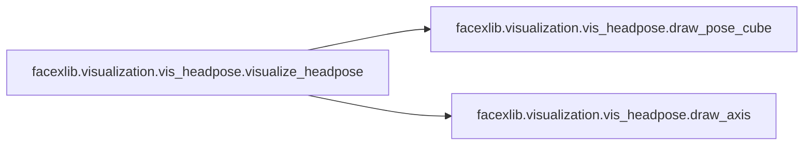

# Facexlib Visualization

[_Documentation generated by Documatic_](https://www.documatic.com)

<!---Documatic-section-Codebase Structure-start--->
## Codebase Structure

<!---Documatic-block-system_architecture-start--->
```mermaid
None
```
<!---Documatic-block-system_architecture-end--->

# #
<!---Documatic-section-Codebase Structure-end--->

<!---Documatic-section-facexlib.visualization.vis_detection.visualize_detection-start--->
## [facexlib.visualization.vis_detection.visualize_detection](4-facexlib_visualization.md#facexlib.visualization.vis_detection.visualize_detection)

<!---Documatic-section-visualize_detection-start--->
<!---Documatic-block-facexlib.visualization.vis_detection.visualize_detection-start--->
<details>
	<summary><code>facexlib.visualization.vis_detection.visualize_detection</code> code snippet</summary>

```python
def visualize_detection(img, bboxes_and_landmarks, save_path=None, to_bgr=False):
    img = np.copy(img)
    if to_bgr:
        img = cv2.cvtColor(img, cv2.COLOR_RGB2BGR)
    for b in bboxes_and_landmarks:
        cv2.putText(img, f'{b[4]:.4f}', (int(b[0]), int(b[1] + 12)), cv2.FONT_HERSHEY_DUPLEX, 0.5, (255, 255, 255))
        b = list(map(int, b))
        cv2.rectangle(img, (b[0], b[1]), (b[2], b[3]), (0, 0, 255), 2)
        cv2.circle(img, (b[5], b[6]), 1, (0, 0, 255), 4)
        cv2.circle(img, (b[7], b[8]), 1, (0, 255, 255), 4)
        cv2.circle(img, (b[9], b[10]), 1, (255, 0, 255), 4)
        cv2.circle(img, (b[11], b[12]), 1, (0, 255, 0), 4)
        cv2.circle(img, (b[13], b[14]), 1, (255, 0, 0), 4)
    if save_path is not None:
        cv2.imwrite(save_path, img)
```
</details>
<!---Documatic-block-facexlib.visualization.vis_detection.visualize_detection-end--->
<!---Documatic-section-visualize_detection-end--->

# #
<!---Documatic-section-facexlib.visualization.vis_detection.visualize_detection-end--->

<!---Documatic-section-facexlib.visualization.vis_alignment.visualize_alignment-start--->
## [facexlib.visualization.vis_alignment.visualize_alignment](4-facexlib_visualization.md#facexlib.visualization.vis_alignment.visualize_alignment)

<!---Documatic-section-visualize_alignment-start--->
<!---Documatic-block-facexlib.visualization.vis_alignment.visualize_alignment-start--->
<details>
	<summary><code>facexlib.visualization.vis_alignment.visualize_alignment</code> code snippet</summary>

```python
def visualize_alignment(img, landmarks, save_path=None, to_bgr=False):
    img = np.copy(img)
    (h, w) = img.shape[0:2]
    circle_size = int(max(h, w) / 150)
    if to_bgr:
        img = cv2.cvtColor(img, cv2.COLOR_RGB2BGR)
    for landmarks_face in landmarks:
        for lm in landmarks_face:
            cv2.circle(img, (int(lm[0]), int(lm[1])), 1, (0, 150, 0), circle_size)
    if save_path is not None:
        cv2.imwrite(save_path, img)
```
</details>
<!---Documatic-block-facexlib.visualization.vis_alignment.visualize_alignment-end--->
<!---Documatic-section-visualize_alignment-end--->

# #
<!---Documatic-section-facexlib.visualization.vis_alignment.visualize_alignment-end--->

<!---Documatic-section-facexlib.visualization.vis_headpose.visualize_headpose-start--->
## [facexlib.visualization.vis_headpose.visualize_headpose](4-facexlib_visualization.md#facexlib.visualization.vis_headpose.visualize_headpose)

<!---Documatic-section-visualize_headpose-start--->


### Object Calls

* [facexlib.visualization.vis_headpose.draw_pose_cube](4-facexlib_visualization.md#facexlib.visualization.vis_headpose.draw_pose_cube)
* [facexlib.visualization.vis_headpose.draw_axis](4-facexlib_visualization.md#facexlib.visualization.vis_headpose.draw_axis)

<!---Documatic-block-facexlib.visualization.vis_headpose.visualize_headpose-start--->
<details>
	<summary><code>facexlib.visualization.vis_headpose.visualize_headpose</code> code snippet</summary>

```python
def visualize_headpose(img, yaw, pitch, roll, save_path=None, to_bgr=False):
    img = np.copy(img)
    if to_bgr:
        img = cv2.cvtColor(img, cv2.COLOR_RGB2BGR)
    show_string = f'y {yaw[0].item():.2f}, p {pitch[0].item():.2f}, ' + f'r {roll[0].item():.2f}'
    cv2.putText(img, show_string, (30, img.shape[0] - 30), fontFace=1, fontScale=1, color=(0, 0, 255), thickness=2)
    draw_pose_cube(img, yaw[0], pitch[0], roll[0], size=100)
    draw_axis(img, yaw[0], pitch[0], roll[0], tdx=50, tdy=50, size=100)
    if save_path is not None:
        cv2.imwrite(save_path, img)
```
</details>
<!---Documatic-block-facexlib.visualization.vis_headpose.visualize_headpose-end--->
<!---Documatic-section-visualize_headpose-end--->

# #
<!---Documatic-section-facexlib.visualization.vis_headpose.visualize_headpose-end--->

<!---Documatic-section-facexlib.visualization.vis_headpose.draw_pose_cube-start--->
## [facexlib.visualization.vis_headpose.draw_pose_cube](4-facexlib_visualization.md#facexlib.visualization.vis_headpose.draw_pose_cube)

<!---Documatic-section-draw_pose_cube-start--->
<!---Documatic-block-facexlib.visualization.vis_headpose.draw_pose_cube-start--->
<details>
	<summary><code>facexlib.visualization.vis_headpose.draw_pose_cube</code> code snippet</summary>

```python
def draw_pose_cube(img, yaw, pitch, roll, tdx=None, tdy=None, size=150.0):
    p = pitch * np.pi / 180
    y = -yaw * np.pi / 180
    r = roll * np.pi / 180
    if tdx is not None and tdy is not None:
        face_x = tdx - 0.5 * size
        face_y = tdy - 0.5 * size
    else:
        (height, width) = img.shape[:2]
        face_x = width / 2 - 0.5 * size
        face_y = height / 2 - 0.5 * size
    x1 = size * (cos(y) * cos(r)) + face_x
    y1 = size * (cos(p) * sin(r) + cos(r) * sin(p) * sin(y)) + face_y
    x2 = size * (-cos(y) * sin(r)) + face_x
    y2 = size * (cos(p) * cos(r) - sin(p) * sin(y) * sin(r)) + face_y
    x3 = size * sin(y) + face_x
    y3 = size * (-cos(y) * sin(p)) + face_y
    cv2.line(img, (int(face_x), int(face_y)), (int(x1), int(y1)), (0, 0, 255), 3)
    cv2.line(img, (int(face_x), int(face_y)), (int(x2), int(y2)), (0, 0, 255), 3)
    cv2.line(img, (int(x2), int(y2)), (int(x2 + x1 - face_x), int(y2 + y1 - face_y)), (0, 0, 255), 3)
    cv2.line(img, (int(x1), int(y1)), (int(x1 + x2 - face_x), int(y1 + y2 - face_y)), (0, 0, 255), 3)
    cv2.line(img, (int(face_x), int(face_y)), (int(x3), int(y3)), (255, 0, 0), 2)
    cv2.line(img, (int(x1), int(y1)), (int(x1 + x3 - face_x), int(y1 + y3 - face_y)), (255, 0, 0), 2)
    cv2.line(img, (int(x2), int(y2)), (int(x2 + x3 - face_x), int(y2 + y3 - face_y)), (255, 0, 0), 2)
    cv2.line(img, (int(x2 + x1 - face_x), int(y2 + y1 - face_y)), (int(x3 + x1 + x2 - 2 * face_x), int(y3 + y2 + y1 - 2 * face_y)), (255, 0, 0), 2)
    cv2.line(img, (int(x3 + x1 - face_x), int(y3 + y1 - face_y)), (int(x3 + x1 + x2 - 2 * face_x), int(y3 + y2 + y1 - 2 * face_y)), (0, 255, 0), 2)
    cv2.line(img, (int(x2 + x3 - face_x), int(y2 + y3 - face_y)), (int(x3 + x1 + x2 - 2 * face_x), int(y3 + y2 + y1 - 2 * face_y)), (0, 255, 0), 2)
    cv2.line(img, (int(x3), int(y3)), (int(x3 + x1 - face_x), int(y3 + y1 - face_y)), (0, 255, 0), 2)
    cv2.line(img, (int(x3), int(y3)), (int(x3 + x2 - face_x), int(y3 + y2 - face_y)), (0, 255, 0), 2)
    return img
```
</details>
<!---Documatic-block-facexlib.visualization.vis_headpose.draw_pose_cube-end--->
<!---Documatic-section-draw_pose_cube-end--->

# #
<!---Documatic-section-facexlib.visualization.vis_headpose.draw_pose_cube-end--->

<!---Documatic-section-facexlib.visualization.vis_headpose.draw_axis-start--->
## [facexlib.visualization.vis_headpose.draw_axis](4-facexlib_visualization.md#facexlib.visualization.vis_headpose.draw_axis)

<!---Documatic-section-draw_axis-start--->
<!---Documatic-block-facexlib.visualization.vis_headpose.draw_axis-start--->
<details>
	<summary><code>facexlib.visualization.vis_headpose.draw_axis</code> code snippet</summary>

```python
def draw_axis(img, yaw, pitch, roll, tdx=None, tdy=None, size=100):
    pitch = pitch * np.pi / 180
    yaw = -yaw * np.pi / 180
    roll = roll * np.pi / 180
    if tdx is None or tdy is None:
        (height, width) = img.shape[:2]
        tdx = width / 2
        tdy = height / 2
    x1 = size * (cos(yaw) * cos(roll)) + tdx
    y1 = size * (cos(pitch) * sin(roll) + cos(roll) * sin(pitch) * sin(yaw)) + tdy
    x2 = size * (-cos(yaw) * sin(roll)) + tdx
    y2 = size * (cos(pitch) * cos(roll) - sin(pitch) * sin(yaw) * sin(roll)) + tdy
    x3 = size * sin(yaw) + tdx
    y3 = size * (-cos(yaw) * sin(pitch)) + tdy
    cv2.line(img, (int(tdx), int(tdy)), (int(x1), int(y1)), (0, 0, 255), 3)
    cv2.line(img, (int(tdx), int(tdy)), (int(x2), int(y2)), (0, 255, 0), 3)
    cv2.line(img, (int(tdx), int(tdy)), (int(x3), int(y3)), (255, 0, 0), 2)
    return img
```
</details>
<!---Documatic-block-facexlib.visualization.vis_headpose.draw_axis-end--->
<!---Documatic-section-draw_axis-end--->

# #
<!---Documatic-section-facexlib.visualization.vis_headpose.draw_axis-end--->

[_Documentation generated by Documatic_](https://www.documatic.com)