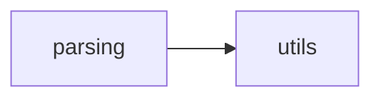
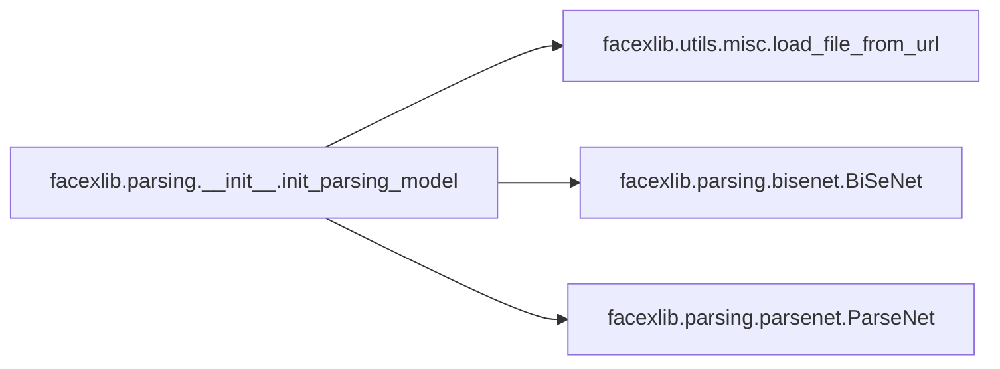

# Facexlib Parsing

[_Documentation generated by Documatic_](https://www.documatic.com)

<!---Documatic-section-Codebase Structure-start--->
## Codebase Structure

<!---Documatic-block-system_architecture-start--->

<!---Documatic-block-system_architecture-end--->

# #
<!---Documatic-section-Codebase Structure-end--->

<!---Documatic-section-facexlib.parsing.__init__.init_parsing_model-start--->
## [facexlib.parsing.__init__.init_parsing_model](5-facexlib_parsing.md#facexlib.parsing.__init__.init_parsing_model)

<!---Documatic-section-init_parsing_model-start--->


### Object Calls

* [facexlib.utils.misc.load_file_from_url](6-facexlib_utils.md#facexlib.utils.misc.load_file_from_url)
* [facexlib.parsing.bisenet.BiSeNet](5-facexlib_parsing.md#facexlib.parsing.bisenet.BiSeNet)
* [facexlib.parsing.parsenet.ParseNet](5-facexlib_parsing.md#facexlib.parsing.parsenet.ParseNet)

<!---Documatic-block-facexlib.parsing.__init__.init_parsing_model-start--->
<details>
	<summary><code>facexlib.parsing.__init__.init_parsing_model</code> code snippet</summary>

```python
def init_parsing_model(model_name='bisenet', half=False, device='cuda', model_rootpath=None):
    if model_name == 'bisenet':
        model = BiSeNet(num_class=19)
        model_url = 'https://github.com/xinntao/facexlib/releases/download/v0.2.0/parsing_bisenet.pth'
    elif model_name == 'parsenet':
        model = ParseNet(in_size=512, out_size=512, parsing_ch=19)
        model_url = 'https://github.com/xinntao/facexlib/releases/download/v0.2.2/parsing_parsenet.pth'
    else:
        raise NotImplementedError(f'{model_name} is not implemented.')
    model_path = load_file_from_url(url=model_url, model_dir='facexlib/weights', progress=True, file_name=None, save_dir=model_rootpath)
    load_net = torch.load(model_path, map_location=lambda storage, loc: storage)
    model.load_state_dict(load_net, strict=True)
    model.eval()
    model = model.to(device)
    return model
```
</details>
<!---Documatic-block-facexlib.parsing.__init__.init_parsing_model-end--->
<!---Documatic-section-init_parsing_model-end--->

# #
<!---Documatic-section-facexlib.parsing.__init__.init_parsing_model-end--->

<!---Documatic-section-facexlib.parsing.bisenet.BiSeNet-start--->
## [facexlib.parsing.bisenet.BiSeNet](5-facexlib_parsing.md#facexlib.parsing.bisenet.BiSeNet)

<!---Documatic-section-BiSeNet-start--->
<!---Documatic-block-facexlib.parsing.bisenet.BiSeNet-start--->
<details>
	<summary><code>facexlib.parsing.bisenet.BiSeNet</code> code snippet</summary>

```python
class BiSeNet(nn.Module):

    def __init__(self, num_class):
        super(BiSeNet, self).__init__()
        self.cp = ContextPath()
        self.ffm = FeatureFusionModule(256, 256)
        self.conv_out = BiSeNetOutput(256, 256, num_class)
        self.conv_out16 = BiSeNetOutput(128, 64, num_class)
        self.conv_out32 = BiSeNetOutput(128, 64, num_class)

    def forward(self, x, return_feat=False):
        (h, w) = x.size()[2:]
        (feat_res8, feat_cp8, feat_cp16) = self.cp(x)
        feat_sp = feat_res8
        feat_fuse = self.ffm(feat_sp, feat_cp8)
        (out, feat) = self.conv_out(feat_fuse)
        (out16, feat16) = self.conv_out16(feat_cp8)
        (out32, feat32) = self.conv_out32(feat_cp16)
        out = F.interpolate(out, (h, w), mode='bilinear', align_corners=True)
        out16 = F.interpolate(out16, (h, w), mode='bilinear', align_corners=True)
        out32 = F.interpolate(out32, (h, w), mode='bilinear', align_corners=True)
        if return_feat:
            feat = F.interpolate(feat, (h, w), mode='bilinear', align_corners=True)
            feat16 = F.interpolate(feat16, (h, w), mode='bilinear', align_corners=True)
            feat32 = F.interpolate(feat32, (h, w), mode='bilinear', align_corners=True)
            return (out, out16, out32, feat, feat16, feat32)
        else:
            return (out, out16, out32)
```
</details>
<!---Documatic-block-facexlib.parsing.bisenet.BiSeNet-end--->
<!---Documatic-section-BiSeNet-end--->

# #
<!---Documatic-section-facexlib.parsing.bisenet.BiSeNet-end--->

<!---Documatic-section-facexlib.parsing.parsenet.ParseNet-start--->
## [facexlib.parsing.parsenet.ParseNet](5-facexlib_parsing.md#facexlib.parsing.parsenet.ParseNet)

<!---Documatic-section-ParseNet-start--->
<!---Documatic-block-facexlib.parsing.parsenet.ParseNet-start--->
<details>
	<summary><code>facexlib.parsing.parsenet.ParseNet</code> code snippet</summary>

```python
class ParseNet(nn.Module):

    def __init__(self, in_size=128, out_size=128, min_feat_size=32, base_ch=64, parsing_ch=19, res_depth=10, relu_type='LeakyReLU', norm_type='bn', ch_range=[32, 256]):
        super().__init__()
        self.res_depth = res_depth
        act_args = {'norm_type': norm_type, 'relu_type': relu_type}
        (min_ch, max_ch) = ch_range
        ch_clip = lambda x: max(min_ch, min(x, max_ch))
        min_feat_size = min(in_size, min_feat_size)
        down_steps = int(np.log2(in_size // min_feat_size))
        up_steps = int(np.log2(out_size // min_feat_size))
        self.encoder = []
        self.encoder.append(ConvLayer(3, base_ch, 3, 1))
        head_ch = base_ch
        for i in range(down_steps):
            (cin, cout) = (ch_clip(head_ch), ch_clip(head_ch * 2))
            self.encoder.append(ResidualBlock(cin, cout, scale='down', **act_args))
            head_ch = head_ch * 2
        self.body = []
        for i in range(res_depth):
            self.body.append(ResidualBlock(ch_clip(head_ch), ch_clip(head_ch), **act_args))
        self.decoder = []
        for i in range(up_steps):
            (cin, cout) = (ch_clip(head_ch), ch_clip(head_ch // 2))
            self.decoder.append(ResidualBlock(cin, cout, scale='up', **act_args))
            head_ch = head_ch // 2
        self.encoder = nn.Sequential(*self.encoder)
        self.body = nn.Sequential(*self.body)
        self.decoder = nn.Sequential(*self.decoder)
        self.out_img_conv = ConvLayer(ch_clip(head_ch), 3)
        self.out_mask_conv = ConvLayer(ch_clip(head_ch), parsing_ch)

    def forward(self, x):
        feat = self.encoder(x)
        x = feat + self.body(feat)
        x = self.decoder(x)
        out_img = self.out_img_conv(x)
        out_mask = self.out_mask_conv(x)
        return (out_mask, out_img)
```
</details>
<!---Documatic-block-facexlib.parsing.parsenet.ParseNet-end--->
<!---Documatic-section-ParseNet-end--->

# #
<!---Documatic-section-facexlib.parsing.parsenet.ParseNet-end--->

[_Documentation generated by Documatic_](https://www.documatic.com)