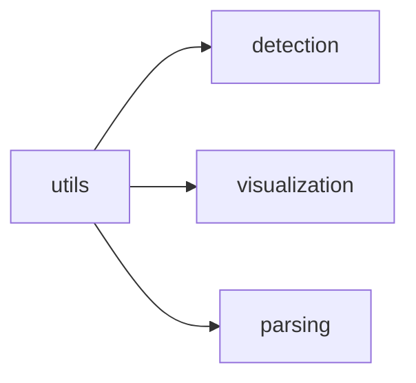

# Facexlib Utils

[_Documentation generated by Documatic_](https://www.documatic.com)

<!---Documatic-section-Codebase Structure-start--->
## Codebase Structure

<!---Documatic-block-system_architecture-start--->

<!---Documatic-block-system_architecture-end--->

# #
<!---Documatic-section-Codebase Structure-end--->

<!---Documatic-section-facexlib.utils.misc.load_file_from_url-start--->
## [facexlib.utils.misc.load_file_from_url](6-facexlib_utils.md#facexlib.utils.misc.load_file_from_url)

<!---Documatic-section-load_file_from_url-start--->
<!---Documatic-block-facexlib.utils.misc.load_file_from_url-start--->
<details>
	<summary><code>facexlib.utils.misc.load_file_from_url</code> code snippet</summary>

```python
def load_file_from_url(url, model_dir=None, progress=True, file_name=None, save_dir=None):
    if model_dir is None:
        hub_dir = get_dir()
        model_dir = os.path.join(hub_dir, 'checkpoints')
    if save_dir is None:
        save_dir = os.path.join(ROOT_DIR, model_dir)
    os.makedirs(save_dir, exist_ok=True)
    parts = urlparse(url)
    filename = os.path.basename(parts.path)
    if file_name is not None:
        filename = file_name
    cached_file = os.path.abspath(os.path.join(save_dir, filename))
    if not os.path.exists(cached_file):
        print(f'Downloading: "{url}" to {cached_file}\n')
        download_url_to_file(url, cached_file, hash_prefix=None, progress=progress)
    return cached_file
```
</details>
<!---Documatic-block-facexlib.utils.misc.load_file_from_url-end--->
<!---Documatic-section-load_file_from_url-end--->

# #
<!---Documatic-section-facexlib.utils.misc.load_file_from_url-end--->

<!---Documatic-section-facexlib.utils.misc.img2tensor-start--->
## [facexlib.utils.misc.img2tensor](6-facexlib_utils.md#facexlib.utils.misc.img2tensor)

<!---Documatic-section-img2tensor-start--->
<!---Documatic-block-facexlib.utils.misc.img2tensor-start--->
<details>
	<summary><code>facexlib.utils.misc.img2tensor</code> code snippet</summary>

```python
def img2tensor(imgs, bgr2rgb=True, float32=True):

    def _totensor(img, bgr2rgb, float32):
        if img.shape[2] == 3 and bgr2rgb:
            if img.dtype == 'float64':
                img = img.astype('float32')
            img = cv2.cvtColor(img, cv2.COLOR_BGR2RGB)
        img = torch.from_numpy(img.transpose(2, 0, 1))
        if float32:
            img = img.float()
        return img
    if isinstance(imgs, list):
        return [_totensor(img, bgr2rgb, float32) for img in imgs]
    else:
        return _totensor(imgs, bgr2rgb, float32)
```
</details>
<!---Documatic-block-facexlib.utils.misc.img2tensor-end--->
<!---Documatic-section-img2tensor-end--->

# #
<!---Documatic-section-facexlib.utils.misc.img2tensor-end--->

<!---Documatic-section-facexlib.utils.face_restoration_helper.get_largest_face-start--->
## [facexlib.utils.face_restoration_helper.get_largest_face](6-facexlib_utils.md#facexlib.utils.face_restoration_helper.get_largest_face)

<!---Documatic-section-get_largest_face-start--->
<!---Documatic-block-facexlib.utils.face_restoration_helper.get_largest_face-start--->
<details>
	<summary><code>facexlib.utils.face_restoration_helper.get_largest_face</code> code snippet</summary>

```python
def get_largest_face(det_faces, h, w):

    def get_location(val, length):
        if val < 0:
            return 0
        elif val > length:
            return length
        else:
            return val
    face_areas = []
    for det_face in det_faces:
        left = get_location(det_face[0], w)
        right = get_location(det_face[2], w)
        top = get_location(det_face[1], h)
        bottom = get_location(det_face[3], h)
        face_area = (right - left) * (bottom - top)
        face_areas.append(face_area)
    largest_idx = face_areas.index(max(face_areas))
    return (det_faces[largest_idx], largest_idx)
```
</details>
<!---Documatic-block-facexlib.utils.face_restoration_helper.get_largest_face-end--->
<!---Documatic-section-get_largest_face-end--->

# #
<!---Documatic-section-facexlib.utils.face_restoration_helper.get_largest_face-end--->

<!---Documatic-section-facexlib.utils.misc.imwrite-start--->
## [facexlib.utils.misc.imwrite](6-facexlib_utils.md#facexlib.utils.misc.imwrite)

<!---Documatic-section-imwrite-start--->
<!---Documatic-block-facexlib.utils.misc.imwrite-start--->
<details>
	<summary><code>facexlib.utils.misc.imwrite</code> code snippet</summary>

```python
def imwrite(img, file_path, params=None, auto_mkdir=True):
    if auto_mkdir:
        dir_name = os.path.abspath(os.path.dirname(file_path))
        os.makedirs(dir_name, exist_ok=True)
    return cv2.imwrite(file_path, img, params)
```
</details>
<!---Documatic-block-facexlib.utils.misc.imwrite-end--->
<!---Documatic-section-imwrite-end--->

# #
<!---Documatic-section-facexlib.utils.misc.imwrite-end--->

<!---Documatic-section-facexlib.utils.face_utils.align_crop_face_landmarks-start--->
## [facexlib.utils.face_utils.align_crop_face_landmarks](6-facexlib_utils.md#facexlib.utils.face_utils.align_crop_face_landmarks)

<!---Documatic-section-align_crop_face_landmarks-start--->
<!---Documatic-block-facexlib.utils.face_utils.align_crop_face_landmarks-start--->
<details>
	<summary><code>facexlib.utils.face_utils.align_crop_face_landmarks</code> code snippet</summary>

```python
def align_crop_face_landmarks(img, landmarks, output_size, transform_size=None, enable_padding=True, return_inverse_affine=False, shrink_ratio=(1, 1)):
    lm_type = 'retinaface_5'
    if isinstance(shrink_ratio, (float, int)):
        shrink_ratio = (shrink_ratio, shrink_ratio)
    if transform_size is None:
        transform_size = output_size * 4
    lm = np.array(landmarks)
    if lm.shape[0] == 5 and lm_type == 'retinaface_5':
        eye_left = lm[0]
        eye_right = lm[1]
        mouth_avg = (lm[3] + lm[4]) * 0.5
    elif lm.shape[0] == 5 and lm_type == 'dlib_5':
        lm_eye_left = lm[2:4]
        lm_eye_right = lm[0:2]
        eye_left = np.mean(lm_eye_left, axis=0)
        eye_right = np.mean(lm_eye_right, axis=0)
        mouth_avg = lm[4]
    elif lm.shape[0] == 68:
        lm_eye_left = lm[36:42]
        lm_eye_right = lm[42:48]
        eye_left = np.mean(lm_eye_left, axis=0)
        eye_right = np.mean(lm_eye_right, axis=0)
        mouth_avg = (lm[48] + lm[54]) * 0.5
    elif lm.shape[0] == 98:
        lm_eye_left = lm[60:68]
        lm_eye_right = lm[68:76]
        eye_left = np.mean(lm_eye_left, axis=0)
        eye_right = np.mean(lm_eye_right, axis=0)
        mouth_avg = (lm[76] + lm[82]) * 0.5
    eye_avg = (eye_left + eye_right) * 0.5
    eye_to_eye = eye_right - eye_left
    eye_to_mouth = mouth_avg - eye_avg
    x = eye_to_eye - np.flipud(eye_to_mouth) * [-1, 1]
    x /= np.hypot(*x)
    rect_scale = 1
    x *= max(np.hypot(*eye_to_eye) * 2.0 * rect_scale, np.hypot(*eye_to_mouth) * 1.8 * rect_scale)
    y = np.flipud(x) * [-1, 1]
    x *= shrink_ratio[1]
    y *= shrink_ratio[0]
    c = eye_avg + eye_to_mouth * 0.1
    quad = np.stack([c - x - y, c - x + y, c + x + y, c + x - y])
    qsize = np.hypot(*x) * 2
    quad_ori = np.copy(quad)
    shrink = int(np.floor(qsize / output_size * 0.5))
    if shrink > 1:
        (h, w) = img.shape[0:2]
        rsize = (int(np.rint(float(w) / shrink)), int(np.rint(float(h) / shrink)))
        img = cv2.resize(img, rsize, interpolation=cv2.INTER_AREA)
        quad /= shrink
        qsize /= shrink
    (h, w) = img.shape[0:2]
    border = max(int(np.rint(qsize * 0.1)), 3)
    crop = (int(np.floor(min(quad[:, 0]))), int(np.floor(min(quad[:, 1]))), int(np.ceil(max(quad[:, 0]))), int(np.ceil(max(quad[:, 1]))))
    crop = (max(crop[0] - border, 0), max(crop[1] - border, 0), min(crop[2] + border, w), min(crop[3] + border, h))
    if crop[2] - crop[0] < w or crop[3] - crop[1] < h:
        img = img[crop[1]:crop[3], crop[0]:crop[2], :]
        quad -= crop[0:2]
    (h, w) = img.shape[0:2]
    pad = (int(np.floor(min(quad[:, 0]))), int(np.floor(min(quad[:, 1]))), int(np.ceil(max(quad[:, 0]))), int(np.ceil(max(quad[:, 1]))))
    pad = (max(-pad[0] + border, 0), max(-pad[1] + border, 0), max(pad[2] - w + border, 0), max(pad[3] - h + border, 0))
    if enable_padding and max(pad) > border - 4:
        pad = np.maximum(pad, int(np.rint(qsize * 0.3)))
        img = np.pad(img, ((pad[1], pad[3]), (pad[0], pad[2]), (0, 0)), 'reflect')
        (h, w) = img.shape[0:2]
        (y, x, _) = np.ogrid[:h, :w, :1]
        mask = np.maximum(1.0 - np.minimum(np.float32(x) / pad[0], np.float32(w - 1 - x) / pad[2]), 1.0 - np.minimum(np.float32(y) / pad[1], np.float32(h - 1 - y) / pad[3]))
        blur = int(qsize * 0.02)
        if blur % 2 == 0:
            blur += 1
        blur_img = cv2.boxFilter(img, 0, ksize=(blur, blur))
        img = img.astype('float32')
        img += (blur_img - img) * np.clip(mask * 3.0 + 1.0, 0.0, 1.0)
        img += (np.median(img, axis=(0, 1)) - img) * np.clip(mask, 0.0, 1.0)
        img = np.clip(img, 0, 255)
        quad += pad[:2]
    h_ratio = shrink_ratio[0] / shrink_ratio[1]
    (dst_h, dst_w) = (int(transform_size * h_ratio), transform_size)
    template = np.array([[0, 0], [0, dst_h], [dst_w, dst_h], [dst_w, 0]])
    affine_matrix = cv2.estimateAffinePartial2D(quad, template, method=cv2.LMEDS)[0]
    cropped_face = cv2.warpAffine(img, affine_matrix, (dst_w, dst_h), borderMode=cv2.BORDER_CONSTANT, borderValue=(135, 133, 132))
    if output_size < transform_size:
        cropped_face = cv2.resize(cropped_face, (output_size, int(output_size * h_ratio)), interpolation=cv2.INTER_LINEAR)
    if return_inverse_affine:
        (dst_h, dst_w) = (int(output_size * h_ratio), output_size)
        template = np.array([[0, 0], [0, dst_h], [dst_w, dst_h], [dst_w, 0]])
        affine_matrix = cv2.estimateAffinePartial2D(quad_ori, np.array([[0, 0], [0, output_size], [dst_w, dst_h], [dst_w, 0]]), method=cv2.LMEDS)[0]
        inverse_affine = cv2.invertAffineTransform(affine_matrix)
    else:
        inverse_affine = None
    return (cropped_face, inverse_affine)
```
</details>
<!---Documatic-block-facexlib.utils.face_utils.align_crop_face_landmarks-end--->
<!---Documatic-section-align_crop_face_landmarks-end--->

# #
<!---Documatic-section-facexlib.utils.face_utils.align_crop_face_landmarks-end--->

<!---Documatic-section-facexlib.utils.face_utils.compute_increased_bbox-start--->
## [facexlib.utils.face_utils.compute_increased_bbox](6-facexlib_utils.md#facexlib.utils.face_utils.compute_increased_bbox)

<!---Documatic-section-compute_increased_bbox-start--->
<!---Documatic-block-facexlib.utils.face_utils.compute_increased_bbox-start--->
<details>
	<summary><code>facexlib.utils.face_utils.compute_increased_bbox</code> code snippet</summary>

```python
def compute_increased_bbox(bbox, increase_area, preserve_aspect=True):
    (left, top, right, bot) = bbox
    width = right - left
    height = bot - top
    if preserve_aspect:
        width_increase = max(increase_area, ((1 + 2 * increase_area) * height - width) / (2 * width))
        height_increase = max(increase_area, ((1 + 2 * increase_area) * width - height) / (2 * height))
    else:
        width_increase = height_increase = increase_area
    left = int(left - width_increase * width)
    top = int(top - height_increase * height)
    right = int(right + width_increase * width)
    bot = int(bot + height_increase * height)
    return (left, top, right, bot)
```
</details>
<!---Documatic-block-facexlib.utils.face_utils.compute_increased_bbox-end--->
<!---Documatic-section-compute_increased_bbox-end--->

# #
<!---Documatic-section-facexlib.utils.face_utils.compute_increased_bbox-end--->

<!---Documatic-section-facexlib.utils.face_utils.get_valid_bboxes-start--->
## [facexlib.utils.face_utils.get_valid_bboxes](6-facexlib_utils.md#facexlib.utils.face_utils.get_valid_bboxes)

<!---Documatic-section-get_valid_bboxes-start--->
<!---Documatic-block-facexlib.utils.face_utils.get_valid_bboxes-start--->
<details>
	<summary><code>facexlib.utils.face_utils.get_valid_bboxes</code> code snippet</summary>

```python
def get_valid_bboxes(bboxes, h, w):
    left = max(bboxes[0], 0)
    top = max(bboxes[1], 0)
    right = min(bboxes[2], w)
    bottom = min(bboxes[3], h)
    return (left, top, right, bottom)
```
</details>
<!---Documatic-block-facexlib.utils.face_utils.get_valid_bboxes-end--->
<!---Documatic-section-get_valid_bboxes-end--->

# #
<!---Documatic-section-facexlib.utils.face_utils.get_valid_bboxes-end--->

<!---Documatic-section-facexlib.utils.face_utils.paste_face_back-start--->
## [facexlib.utils.face_utils.paste_face_back](6-facexlib_utils.md#facexlib.utils.face_utils.paste_face_back)

<!---Documatic-section-paste_face_back-start--->
<!---Documatic-block-facexlib.utils.face_utils.paste_face_back-start--->
<details>
	<summary><code>facexlib.utils.face_utils.paste_face_back</code> code snippet</summary>

```python
def paste_face_back(img, face, inverse_affine):
    (h, w) = img.shape[0:2]
    (face_h, face_w) = face.shape[0:2]
    inv_restored = cv2.warpAffine(face, inverse_affine, (w, h))
    mask = np.ones((face_h, face_w, 3), dtype=np.float32)
    inv_mask = cv2.warpAffine(mask, inverse_affine, (w, h))
    inv_mask_erosion = cv2.erode(inv_mask, np.ones((2, 2), np.uint8))
    inv_restored_remove_border = inv_mask_erosion * inv_restored
    total_face_area = np.sum(inv_mask_erosion) // 3
    w_edge = int(total_face_area ** 0.5) // 20
    erosion_radius = w_edge * 2
    inv_mask_center = cv2.erode(inv_mask_erosion, np.ones((erosion_radius, erosion_radius), np.uint8))
    blur_size = w_edge * 2
    inv_soft_mask = cv2.GaussianBlur(inv_mask_center, (blur_size + 1, blur_size + 1), 0)
    img = inv_soft_mask * inv_restored_remove_border + (1 - inv_soft_mask) * img
    return img
```
</details>
<!---Documatic-block-facexlib.utils.face_utils.paste_face_back-end--->
<!---Documatic-section-paste_face_back-end--->

# #
<!---Documatic-section-facexlib.utils.face_utils.paste_face_back-end--->

<!---Documatic-section-facexlib.utils.misc.scandir-start--->
## [facexlib.utils.misc.scandir](6-facexlib_utils.md#facexlib.utils.misc.scandir)

<!---Documatic-section-scandir-start--->
<!---Documatic-block-facexlib.utils.misc.scandir-start--->
<details>
	<summary><code>facexlib.utils.misc.scandir</code> code snippet</summary>

```python
def scandir(dir_path, suffix=None, recursive=False, full_path=False):
    if suffix is not None and (not isinstance(suffix, (str, tuple))):
        raise TypeError('"suffix" must be a string or tuple of strings')
    root = dir_path

    def _scandir(dir_path, suffix, recursive):
        for entry in os.scandir(dir_path):
            if not entry.name.startswith('.') and entry.is_file():
                if full_path:
                    return_path = entry.path
                else:
                    return_path = osp.relpath(entry.path, root)
                if suffix is None:
                    yield return_path
                elif return_path.endswith(suffix):
                    yield return_path
            elif recursive:
                yield from _scandir(entry.path, suffix=suffix, recursive=recursive)
            else:
                continue
    return _scandir(dir_path, suffix=suffix, recursive=recursive)
```
</details>
<!---Documatic-block-facexlib.utils.misc.scandir-end--->
<!---Documatic-section-scandir-end--->

# #
<!---Documatic-section-facexlib.utils.misc.scandir-end--->

[_Documentation generated by Documatic_](https://www.documatic.com)